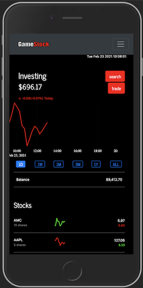
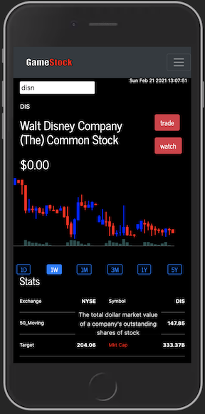

# GameStock

 

[See the deployment](https://gamestock-app.herokuapp.com/)  
[Explore the docs](https://github.com/seattletrade/gamestock)

---

## Table of Contents

- [About the Project](#About-the-Project)
- [Usage](#Usage)
- [Getting Started](#Getting-Started)
  - [Installation](#Installation)
- [Contributing](#Contributing)
- [License](#License)
- [Questions](#Questions)

## About the Project

## Usage

Run the following commands in your terminal

    npm start

Navigate in the browser to

    localhost:3000

## Getting Started

To get started, follow these steps:

### Installation

Run the following commands in your terminal

    npm i

## Contributing

Contributions are welcome! Please create an issue or pull request with your input.

## License

This application is covered under the MIT license

## Questions

For any questions, please reach out by creating an issue.

Developer's Repos  
[lexi jack](http://github.com/puakehaulani)  
[Jehyun Jung](https://github.com/congmul)  
[Girma Ebssa](https://github.com/girmaD)  
[Olga Illarionova](https://github.com/Myau5x)
